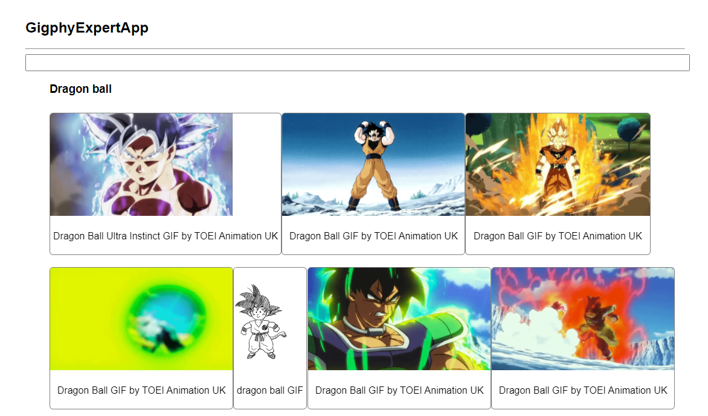

# Gigphy-Expert-App

webApp de practica que conecta con endpoints de Giphy para hacer busquedas de gifs animados. Basado en el curso de Fernando Herrera - React: De cero a experto ( Hooks y MERN )

### Librerías utilizadas
- React
- animate.css
- wojtekmaj / enzyme-adapter-react-17
- enzyme-to-json

### Instrucciones.
Para instalar y ejecutar.
```
npm install
npm start
```

### Enlaces de interes:
https://github.com/wojtekmaj/enzyme-adapter-react-17
https://www.npmjs.com/package/enzyme-to-json


